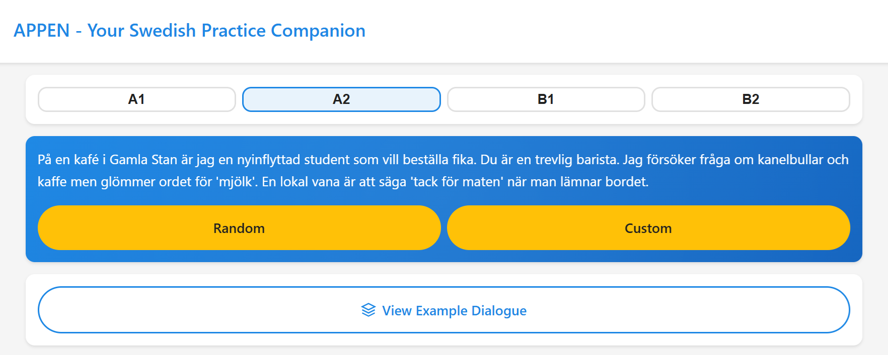

# 🇸🇪 APPEN - Immersive Swedish Conversation Practice

> A modern web application designed for Swedish learners to break through the speaking barrier and build confidence. **Practice real-time, scenario-based conversations with an interactive partner, get instant feedback with speech recognition, and learn pronunciation from lifelike audio synthesis. As a web app, it works seamlessly across all your devices, including iOS, Android, and desktop computers.**

[](https://github.com)
[](https://opensource.org/licenses/MIT)
[](https://www.python.org/downloads/)
[](https://fastapi.tiangolo.com/)

---
<br>

## 💎 Easy to use, packed with features


<br>

## ✨ Why APPEN?

APPEN is engineered for a superior user experience, combining powerful learning features with a high-performance technical foundation.

* **🎯 Adaptive CEFR Levels**: Supports proficiency levels from A1 (Beginner) to B2 (Upper-Intermediate). The vocabulary and grammar adjust to match your skill level.

* **✍️ Custom Practice Scenarios**: Go beyond random scenarios by creating your own situations to practice topics that matter most to you.

* **🤖 Interactive Realistic Conversations**: Engage in smooth, natural conversations with an intelligent partner that can adapt to various real-world roles.

* **🎧 Lifelike Audio Synthesis**: The partner's responses are delivered with clear, natural-sounding Swedish audio, helping you master pronunciation and intonation.

* **🌐 Zero-Installation, Cross-Platform**: As a pure web application, there's no need for app store downloads. Start practicing instantly with just a link on any device (phone, tablet, or desktop).

* **🚀 Lightweight & High-Performance**: The frontend is built entirely with **Vanilla JavaScript**, free from heavy frameworks. This ensures lightning-fast load times and a smooth, responsive experience.

<br>

---

<br>

## 🚀 Getting Started

To get a local copy up and running, follow these simple steps.

### Prerequisites

* **Anaconda** or **Miniconda**
* Python 3.10 or higher
* `git` for cloning the repository

<br>

### Installation & Setup

1.  **Clone the repository:**
    ```sh
    git clone https://github.com/zhugt2019/APPEN.git
    cd APPEN
    ```

2.  **Set up the Backend Environment with Anaconda:**
    ```sh
    # Create a new conda environment named 'appen' with Python 3.10
    conda create --name appen python=3.10 -y

    # Activate the new environment
    conda activate appen

    # Install the required Python packages
    pip install -r requirements.txt
    ```

3.  **Configure Environment Variables:**
    The application reads API keys as environment variables. You can set them in one of two ways:

    **Method A (Recommended): Use a `.env` file**
    Create a `backend/.env` file and add your API keys. This method is ideal for local development.
    ```env
    # backend/.env
    GEMINI_API_KEY="YOUR_GOOGLE_GEMINI_API_KEY"
    DEEPSEEK_API_KEY="YOUR_DEEPSEEK_API_KEY"
    ```

    **Method B: Use System Environment Variables**
    Alternatively, you can set these as system-wide environment variables. The application will automatically detect them. This is common for production deployments.

4.  **Set up ngrok (if you want to create a public URL):**
    * [Sign up for a free ngrok account](https://dashboard.ngrok.com/signup) to get your authtoken.
    * Install ngrok on your system if you haven't already.
    * Configure your authtoken by running the command provided on your ngrok dashboard:
    ```sh
    ngrok config add-authtoken YOUR_NGROK_AUTHTOKEN

5.  **Run the Application:**
    You will need two terminal windows open.

    **In your first terminal (from the `backend` directory):**
    Start the main application server.
    ```sh
    uvicorn backend.api:app --reload --host 0.0.0.0 --port 8000
    ```

    **In your second terminal:**
    Use `ngrok` to expose your local server to the internet.
    ```sh
    ngrok http 8000
    ```
    Copy the public URL provided by ngrok (e.g., `https://random-string.ngrok-free.app`) and open it in your browser to start practicing!

<br>

---

<br>

## 💻 Tech Stack

| Category    | Technologies & Models                                                                                                                                                             |
| :---------- | :-------------------------------------------------------------------------------------------------------------------------------------------------------------------------------- |
| **Backend** | `Python 3.8+`, `FastAPI`, `Uvicorn`, `PyTorch`, `Pydub`<br>**STT Model:** `KBLab/kb-whisper-small`<br>**TTS Model:** `facebook/mms-tts-swe`<br>**LLMs:** `Google Gemini API`, `DeepSeek API` |
| **Frontend** | `Vanilla JavaScript (ES6)`, `HTML5`, `CSS3`, `MediaRecorder API`, `Web Audio API`                                                                                                    |
| **PWA** | `Service Workers`, `Web App Manifest`                                                                                                                                               |

<br>

---

<br>

## 🗺️ Future Roadmap

We are committed to evolving APPEN into a comprehensive language learning toolkit. Here are the features planned for future releases:

### 📚 Smart Dictionary & Vocabulary Review

* **Instant Look-up**: Long-press any word in the dialogue to view its Swedish-English translation and hear its pronunciation.
* **Pronunciation Guide**: A dedicated play button next to each word for standard pronunciation.
* **Efficient Review System**: A vocabulary review module inspired by spaced repetition systems (SRS) like Anki, using flashcards to reinforce memory.
* **Personalized Word Lists**: Allow users to mark words as "mastered" or "learning" to create customized study decks.

### 🎭 Enhanced Scenario Practice

* **Follow-and-Read Mode**: In the example dialogue, users can click each sentence to practice reading it aloud, with the app providing pronunciation feedback.
* **Key Expression Analysis**: Automatically extract and explain key phrases and idiomatic expressions from the dialogue, with detailed translations.
* **Comprehensive Language Coach**: After each practice session, generate a detailed performance report covering grammar, vocabulary, fluency, and areas for improvement.

### 📸 Visual Learning Tools

* **Scan & Translate**: Use the device's camera to scan real-world text (e.g., on menus or signs) and provide instant translations. Support for cropping or selecting specific text areas.
* **Text-to-Speech for Scans**: Generate audio for the recognized text, with adjustable playback speed, turning any visible text into a listening exercise.

<br>

---

<br>

## 📜 License

Distributed under the Apache License. See `LICENSE` for more information.

<br>

---

<br>

## 🙏 Acknowledgements

* [FastAPI](https://fastapi.tiangolo.com/)
* [Hugging Face Transformers](https://huggingface.co/docs/transformers/index)
* [Pydub](https://github.com/jiaaro/pydub)
